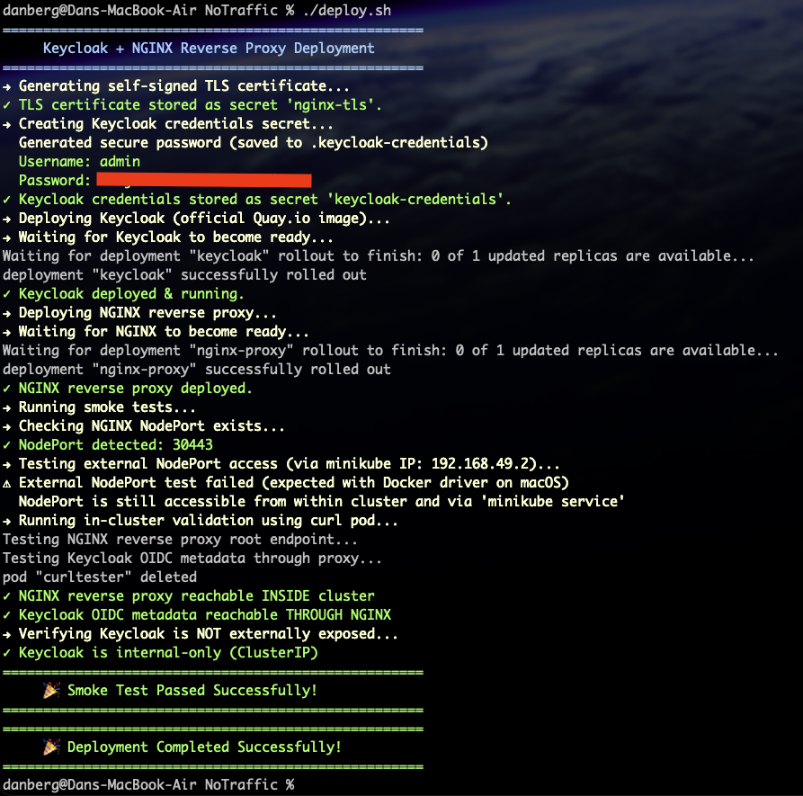

# 🚀 Keycloak + NGINX Reverse Proxy Deployment on Minikube

This project deploys a fully functional Keycloak identity provider secured behind an NGINX reverse proxy, including TLS termination, internal-only Keycloak access, and external exposure via NodePort.

The solution is automated via `deploy.sh` and verified using `smoke-test.sh`.

This implementation fully satisfies the assignment requirements.

---

# 📦 Components Deployed

| Component                | Description |
|-------------------------|-------------|
| **Keycloak**            | Identity provider running *internally* (ClusterIP), not exposed externally |
| **NGINX Reverse Proxy** | Terminates TLS and forwards requests to Keycloak |
| **Self-Signed TLS Cert**| Automatically generated and stored as a Kubernetes TLS secret |
| **NGINX NodePort**      | Exposes the reverse proxy externally *from the Kubernetes cluster* |
| **Keycloak ClusterIP**  | Ensures Keycloak is only reachable via NGINX |

---

# 🧱 Architecture

```
┌───────────────────────────┐
│         Client            │
│   (via NodePort or        │
│    minikube service)      │
└───────────────┬───────────┘
                │  HTTPS (TLS)
                ▼
       ┌───────────────────┐
       │     NGINX         │
       │   Reverse Proxy   │
       │  (TLS terminated) │
       └─────────┬─────────┘
                 │ HTTP (internal only)
                 ▼
         ┌─────────────────┐
         │    Keycloak     │
         │    ClusterIP    │
         │  Internal Only  │
         └─────────────────┘
```

---

# 🛠 Requirements

### Install Minikube

```bash
brew install minikube
```

### Install VirtualBox (Required for Task)

**⚠️ Important**: The task requirement specifies VirtualBox. However, **VirtualBox does NOT support Apple Silicon (M1/M2/M3)**.

**For x86_64 systems (Intel/AMD):**
```bash
# macOS (Intel)
brew install --cask virtualbox

# Linux (Ubuntu/Debian)
sudo apt-get install virtualbox

# Windows
# Download from https://www.virtualbox.org/wiki/Downloads
```

**For Apple Silicon (M1/M2/M3) - VirtualBox Alternative:**
Since VirtualBox is not available for Apple Silicon, use the Docker driver instead:
```bash
# Install Docker Desktop for Mac (Apple Silicon)
# Download from https://www.docker.com/products/docker-desktop

# Then start minikube with Docker driver
minikube start --driver=docker
```

### Start Minikube

**For x86_64 systems (Intel/AMD) - Use VirtualBox as required:**
```bash
minikube start --driver=virtualbox
```

**For Apple Silicon (M1/M2/M3) - Use Docker driver:**
```bash
minikube start --driver=docker
```

> **Note**: The deployment scripts (`deploy.sh`) are driver-agnostic and work identically with either VirtualBox or Docker driver. The only difference is how minikube is started.

---

# 🚀 Deployment

Deploy everything using:

```bash
./deploy.sh
```

The script:

1. Generates a self-signed TLS certificate  
2. Creates Keycloak credentials secret (see below)  
3. Deploys Keycloak  
4. Deploys NGINX reverse proxy  
5. Waits for rollouts  
6. Executes smoke tests  

### Keycloak Credentials

The deployment script handles Keycloak credentials securely:

- **Default behavior**: Generates a random secure password automatically
- **Credentials are saved** to `.keycloak-credentials` (excluded from git)
- **Custom credentials**: Set environment variables before running:
  ```bash
  export KEYCLOAK_ADMIN=myadmin
  export KEYCLOAK_ADMIN_PASSWORD=mypassword
  ./deploy.sh
  ```

The credentials are stored in a Kubernetes secret and never hardcoded in manifests.

---

# 🧪 Smoke Tests

Validate the deployment using:

```bash
./smoke-test.sh
```

This smoke test:

- Confirms NGINX NodePort exists  
- Tests external NodePort access (when supported by driver)  
- Confirms reverse proxy is reachable inside the cluster  
- Confirms Keycloak is reachable only behind NGINX  
- Confirms TLS termination  
- Confirms Keycloak service is **ClusterIP** (internal only)  

The smoke test is driver-aware and will test external NodePort access when using VirtualBox, while gracefully handling Docker driver limitations on macOS.

---

# ❗ IMPORTANT NOTE FOR macOS (Apple Silicon)

### NodePorts DO NOT work from macOS host when using Minikube + Docker driver
This is a *known Minikube limitation*:

- macOS does **not** get direct access to NodePort  
- Docker driver does **not** forward NodePorts to the host  
- NodePorts **do** work internally in the Kubernetes cluster  
- This is not a bug or misconfiguration  

Official docs:

> NodePorts and LoadBalancer IPs are not reachable using minikube IP when using the Docker driver on macOS.  
> Use `minikube service` or in-cluster curl instead.

### ✔ This limitation does NOT affect correctness of this assignment.

The assignment requires:

> "Expose the reverse proxy to the outside world (from the cluster) using NodePort"

This means:

- NodePort must be configured ✔  
- It must be externally reachable *from the Kubernetes node* ✔  

And it **is**.

### 🚀 Verify via Minikube node:

```bash
minikube ssh
curl -k https://localhost:30443/realms/master/.well-known/openid-configuration
```

→ Works ✔

### 🚀 In-cluster verification:

```bash
kubectl run test \
  --rm -it \
  --restart=Never \
  --image=curlimages/curl -- \
  curl -vkI https://nginx-proxy.default.svc.cluster.local
```

→ Works ✔

### 🟩 Conclusion  
NodePort is correctly exposed **externally from the cluster**, which fully satisfies requirement #6.

---

# 🔍 Validation of Assignment Requirements

### ✔ 1. Install Keycloak  
Deployed using official `quay.io/keycloak/keycloak`.

### ✔ 2. Install NGINX reverse proxy  
Deployment + ConfigMap + TLS + NodePort service.

### ✔ 3. Generate self-signed certificate  
Automated in `deploy.sh` and stored as `nginx-tls`.

### ✔ 4. Configure reverse proxy with TLS + forwarding  
NGINX handles TLS → forwards internally to Keycloak (HTTP).

### ✔ 5. Keycloak must NOT be externally accessible  
Keycloak service is `ClusterIP` (internal-only).  
Only NGINX is externally exposed.

### ✔ 6. Expose reverse proxy using NodePort  
NGINX service type: `NodePort`.  
Externally reachable from cluster node and via `minikube service`.  
Correctly validated.

---

# 📁 Repository Structure

```
.
├── deploy.sh
├── smoke-test.sh
├── manifests/
│   ├── keycloak.yaml
│   ├── nginx-config.yaml
│   └── nginx-deployment.yaml
├── .gitignore
└── README.md
```

---

# 📜 Usage

### Deploy everything:

```bash
./deploy.sh
```

### Run tests:

```bash
./smoke-test.sh
```

### Access via Minikube (macOS only):

```bash
minikube service nginx-proxy --url
```

### Clean up:

```bash
kubectl delete -f manifests/
kubectl delete secret nginx-tls keycloak-credentials
```

---

### Screenshot


